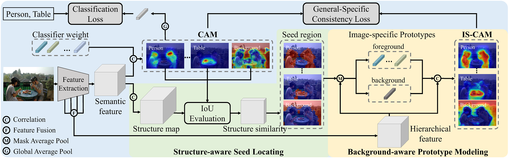

# Self-supervised Image-specific Prototype Exploration for Weakly Supervised Semantic Segmentation (SIPE)



The implementation of [**Self-supervised Image-specific Prototype Exploration for Weakly Supervised Semantic Segmentation**](https://openaccess.thecvf.com/content/CVPR2022/papers/Chen_Self-Supervised_Image-Specific_Prototype_Exploration_for_Weakly_Supervised_Semantic_Segmentation_CVPR_2022_paper.pdf), Qi Chen, Lingxiao Yang, Jianhuang Lai, and Xiaohua Xie, CVPR 2022.

## Abstract
Weakly Supervised Semantic Segmentation (WSSS) based on image-level labels has attracted much attention due to low annotation costs. Existing methods often rely on Class Activation Mapping (CAM) that measures the correlation between image pixels and classifier weight. However, the classifier focuses only on the discriminative regions while ignoring other useful information in each image, resulting in incomplete localization maps. To address this issue, we propose a Self-supervised Image-specific Prototype Exploration (SIPE) that consists of an Image-specific Prototype Exploration (IPE) and a General-Specific Consistency (GSC) loss. Specifically, IPE tailors prototypes for every image to capture complete regions, formed our Image-Specific CAM (IS-CAM), which is realized by two sequential steps. In addition, GSC is proposed to construct the consistency of general CAM and our specific IS-CAM, which further optimizes the feature representation and empowers a self-correction ability of prototype exploration. Extensive experiments are conducted on PASCAL VOC 2012 and MS COCO 2014 segmentation benchmark and results show our SIPE achieves new state-of-the-art performance using only image-level labels.

## Environment

- Python >= 3.6.6
- Pytorch >= 1.6.0
- Torchvision

## Usage

#### Step 1. Prepare Dataset

- PASCAL VOC 2012: [Download](http://host.robots.ox.ac.uk/pascal/VOC/voc2012/).
- MS COCO 2014: [Image](https://cocodataset.org/#home) and [Label](https://drive.google.com/file/d/1Pm_OH8an5MzZh56QKTcdlXNI3RNmZB9d/view?usp=sharing).

#### Step 2. Train SIPE

```bash
# PASCAL VOC 2012
bash run_voc.sh

# MS COCO 2014
bash run_coco.sh
```

#### Step 3. Train Fully Supervised Segmentation Models

To train fully supervised segmentation models, we refer to [deeplab-pytorch](https://github.com/kazuto1011/deeplab-pytorch) and [seamv1](https://github.com/YudeWang/semantic-segmentation-codebase/tree/main/experiment/seamv1-pseudovoc).

## Results

#### Localization maps

| Dataset         | Model       | mIoU (Train) | Weight                                                       | Training log                     |
| --------------- | ----------- | ------------ | ------------------------------------------------------------ | -------------------------------- |
| PASCAL VOC 2012 | CVPR submit | 58.65        | [Download](https://drive.google.com/file/d/1-_GXZq-1gxcbR7FdY1888tnxBAE39R-P/view?usp=sharing) | [Logfile](log/sipe_voc.log)      |
| PASCAL VOC 2012 | This repo   | 58.88        | [Download](https://drive.google.com/file/d/1YYYYXleRperCUrhcU4pT1eXybhlUQedW/view?usp=sharing) | [Logfile](log/sipe_voc_rep.log)  |
| MS COCO 2014    | CVPR submit | 34.41        | [Download](https://drive.google.com/file/d/1qWLvgjyd9eunyWJPyj02HcDQciiMKMu0/view?usp=sharing) | [Logfile](log/sipe_coco.log)     |
| MS COCO 2014    | This repo   | 35.05        | [Download](https://drive.google.com/file/d/103gU8AmTDXSnebh2q9xihOSxw4yoPGZb/view?usp=sharing) | [Logfile](log/sipe_coco_rep.log) |

#### Segmentation maps

| Dataset         | Model       | mIoU (Val) | mIoU (Test)                                                       | Weight                     |
| --------------- | ----------- | ------------ | ------------------------------------------------------------ | -------------------------------- |
| PASCAL VOC 2012 | WideResNet38 | 68.2        | [69.5](http://host.robots.ox.ac.uk:8080/anonymous/NGICBM.html) | [Download](https://drive.google.com/file/d/1V2h-5znTXWQNvOq2cH1nACF9Ym6wd02-/view?usp=sharing)      |
| PASCAL VOC 2012 | ResNet101   | 68.8        | [69.7](http://host.robots.ox.ac.uk:8080/anonymous/UU6VNX.html) | [Download](https://drive.google.com/file/d/1wN7-O-aXNtPgHPIvzr14tfaLssOc2FzI/view?usp=sharing)  |
| MS COCO 2014    | WideResNet38 | 43.6       | - | [Download](https://drive.google.com/file/d/1w9jyHbcR8GzHMNo0QIelWQJFxC33wit4/view?usp=sharing)|
| MS COCO 2014    | ResNet101   | 40.6        | - | [Download](https://drive.google.com/file/d/1WQUzL8wwRnu_9kWh-t-mItyyrMTsH8Kn/view?usp=sharing)|

## Citation
```
@InProceedings{Chen_2022_CVPR_SIPE,
    author    = {Chen, Qi and Yang, Lingxiao and Lai, Jian-Huang and Xie, Xiaohua},
    title     = {Self-Supervised Image-Specific Prototype Exploration for Weakly Supervised Semantic Segmentation},
    booktitle = {Proceedings of the IEEE/CVF Conference on Computer Vision and Pattern Recognition (CVPR)},
    month     = {June},
    year      = {2022},
    pages     = {4288-4298}
}
```
